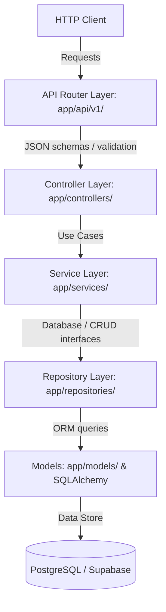

# 🚛 DriveLink AI - Backend Foundation

Welcome to the backend service for **DriveLink AI**, an AI-powered Driver Exchange & Logistics Marketplace.

This backend is built with **Python 3.12+** and **FastAPI** using enterprise clean architecture principles, leveraging dependency injection, service layers, and repositories.

---

## 🏗️ Architecture Design

The backend uses a layered architecture to ensure clean separation of concerns, easy testing, and mockability:



### Key Highlights
- **SOLID Principles**: Each class, module, and package has a single responsibility.
- **Dependency Injection**: FastAPI `Depends` is used for database sessions (`get_db`) and authentication placeholders.
- **Structured Logging**: Integrated `structlog` for structured logging, measuring request times, and tracing correlation IDs.
- **Unified Responses**: Standardized JSON envelopes for API responses (success and error outcomes).
- **Environment Isolation**: Configured through Pydantic Settings, parsing `.env` cleanly.

---

## 📂 Folder Structure

```
backend/
├── app/                      # Main application package
│   ├── api/                  # API versioned HTTP routes
│   │   └── v1/               # API v1 routes
│   │       └── endpoints/    # Router modules for features
│   ├── config/               # Pydantic Settings configurations
│   ├── controllers/          # Translates requests to service calls (Sprint 11)
│   ├── services/             # Core business rules / use cases (Sprint 11)
│   ├── repositories/         # Database operations / SQL execution (Sprint 11)
│   ├── models/               # SQLAlchemy models (Sprint 11)
│   ├── schemas/              # Pydantic request/response schemas (Sprint 11)
│   ├── middleware/           # HTTP middleware pipelines (logging, CORS, etc.)
│   ├── database/             # SQLAlchemy Engine, Session, & DB health checks
│   ├── ai/                   # AI Assistants, OCR, & Validation agents
│   ├── tracking/             # GPS & ETA tracking skeleton (Sprint 11)
│   ├── notifications/        # FCM notifications skeleton (Sprint 11)
│   ├── utils/                # Standardized utilities (exceptions, responses, helpers)
│   └── main.py               # FastAPI application entrypoint
├── tests/                    # Test suite directory
│   ├── unit/                 # Unit test cases
│   ├── integration/          # Integration test cases
│   └── conftest.py           # Pytest settings and client fixtures
├── .env.example              # Environment variables template
├── requirements.txt          # Third-party dependencies listing
└── pyproject.toml            # Build / linting configs (Ruff, Pytest)
```

---

## 🚀 How to Run

### 1. Prerequisites
- Python 3.12+
- PostgreSQL database (or Supabase URL)

### 2. Installation
Navigate to the backend directory and install dependencies:
```bash
cd backend
python -m venv venv
source venv/bin/activate
pip install -r requirements.txt
```

### 3. Environment Setup
Copy the template `.env.example` into a new `.env` file and customize the connection strings:
```bash
cp .env.example .env
```

### 4. Running the Dev Server
Launch the FastAPI uvicorn development server:
```bash
uvicorn app.main:app --reload
```

- **Interactive Documentation**: http://localhost:8000/docs
- **Health Check**: http://localhost:8000/api/v1/health

---

## 🎯 Future Roadmap

- **Sprint 11 (Next Sprint)**:
  - Implement SQLAlchemy models matching Supabase schema.
  - Implement OAuth2/JWT authentication.
  - Implement CRUD services and endpoints for drivers, organizations, and deliveries.
  - Implement smart matching AI algorithm ranking (Rating, Distance, Experience, Completed Deliveries).
  - Implement Live Tracking and Proof of Delivery OCR analysis.
- **Sprint 12 (Testing & Deployment)**:
  - Add comprehensive pytest coverage.
  - Setup CI/CD pipelines.
